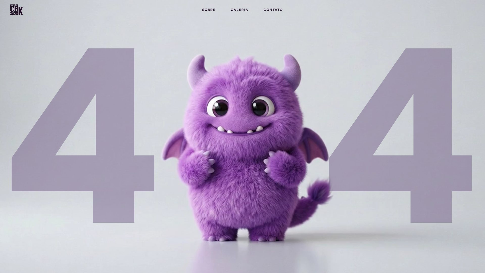

<div align="center">

# Página 404

Página de erro com vídeo em tela cheia que repete indefinidamente sem que se perceba onde o clipe termina e recomeça — sem corte visível e sem transição.




**[Ver o projeto ao vivo](https://otavio-2507.github.io/Pagina-404/)**

</div>

## Visão geral

Uma página de erro é onde a pessoa chega errado, e quase sempre é a tela mais descuidada de um site. Aqui ela é a mais trabalhada: o personagem ocupa a tela inteira, os numerais `4` e `4` o emolduram, e ele é o único elemento com cor viva num campo de cinzas de estúdio.

O problema central não era visual, era temporal. Um vídeo curto em loop denuncia o ponto de emenda, e a solução comum — um cross-dissolve entre o fim e o começo — só troca o salto por um fantasma de dupla exposição. Nenhuma quantidade de CSS resolve isso: quem decide é o quadro em que o corte acontece.

## Funcionalidades

- **Loop contínuo** sem corte perceptível, com o vídeo ocupando toda a viewport.
- **Cabeçalho flutuante** sem fundo, sobreposto à cena, com a marca e a navegação.
- **Menu responsivo** que vira painel abaixo de 820px, operável por teclado.
- **Fallback de autoplay**: se o navegador bloquear, o vídeo parte no primeiro toque ou tecla.
- **Suporte a `prefers-reduced-motion`**, congelando a cena em um quadro estático.
- **Funciona sem JavaScript** — a cena aparece por animação CSS, não por classe injetada.

## Decisões de projeto

Algumas escolhas que não são óbvias pelo código:

**O ponto de corte foi medido, não estimado.** O clipe tem 8,000s exatos a 24 fps. Percorrendo os 192 quadros e comparando cada um com o primeiro, a curva de diferença desce até um mínimo em **t ≈ 7,685s** (quadro 184), onde a diferença é de **0,58%** — menos de um quadro de movimento natural, tomando como unidade a variação média entre quadros vizinhos (0,73%). Os seis quadros seguintes passam do ponto e chegam a 1,90%: eram eles, a cauda sobrando no arquivo, a causa do salto. O corte acontece em 7,66s, dentro da janela de 7,52s a 7,77s em que a diferença fica abaixo de um quadro. Sendo o fechamento imperceptível, o cross-dissolve deixa de ser necessário — e é bom que deixe, porque era ele que produzia o fantasma.

**A troca não tem `seek`.** São dois elementos `<video>`. Enquanto um toca, o outro fica pausado no quadro zero, já decodificado e pronto na tela; trocar significa apenas subir uma camada no `z-index`. Não há busca no arquivo nem espera de buffer no instante crítico. A cópia que sai é pausada e rebobinada escondida atrás da outra, com 7,6 segundos de folga até precisar entrar de novo. O gatilho usa `requestVideoFrameCallback`, que entrega o `mediaTime` exato de cada quadro apresentado — um `setTimeout` acumularia desvio a cada volta e erraria a janela sob buffering.

**O MP4 não declarava sua cor, e o navegador errava o palpite.** O arquivo não tinha caixa `colr` no container, e o SPS do H.264 vinha com `video_signal_type_present_flag = 0`. Sem etiqueta, o Chrome assume BT.709 pela heurística de 720p — mas o material foi codificado com coeficientes **BT.601**, e a matriz errada na conversão YUV→RGB devolvia o personagem **11% menos saturado** que a fonte. A correção foi uma caixa `colr` de 19 bytes inserida no `avc1`, sem recodificar um único quadro: como o `moov` neste arquivo fica depois do `mdat`, crescer o `moov` não desloca os offsets de chunk. O `mdat` continua byte a byte idêntico, conferido por SHA-256.

**Nada de `mix-blend-mode` sobre vídeo em reprodução.** Os numerais usavam `multiply`, que obriga o compositor a reler o fundo a cada quadro numa camada do tamanho da tela. O SVG dependia disso: tinha um retângulo branco cobrindo os 1920×1080, invisível apenas porque branco no multiply não altera nada. Foi reescrito sem o retângulo, com a cor calculada para reproduzir o resultado do multiply sobre o cinza do estúdio — que é onde os dois `4` de fato ficam — usando composição normal.

**A segunda cópia do vídeo espera a primeira.** As duas com `preload="auto"` disparando juntas levavam o navegador a buscar o mesmo arquivo duas vezes, porque nenhuma entrada de cache existia ainda. A reserva nasce sem `src` e só carrega depois do `canplaythrough` da primeira. Sozinho, isso poupa 1,8 MB.

**A entrada da cena é animação, não classe via JavaScript.** A versão anterior aplicava `opacity: 0` e esperava o script adicionar a classe que revelava — o que significa que, com o JavaScript desativado ou falhando, a página ficava **completamente em branco**. Numa página de erro isso é inaceitável: ela precisa ser a última coisa a quebrar.

**O erro é anunciado a leitores de tela.** A cena é decorativa e leva `aria-hidden`, então sem um título a página não teria conteúdo textual algum. Um `<h1>` fora da tela — mas dentro da árvore de acessibilidade — carrega a mensagem sem alterar o desenho.

## Tecnologias

| Tecnologia | Aplicação no projeto |
| --- | --- |
| HTML5 | Estrutura semântica, `<video>` e atributos ARIA |
| CSS3 | Grid, Custom Properties, `clamp()`, `object-fit`, `100svh` |
| JavaScript (ES6+) | Controle do loop, troca de camadas e menu — sem bibliotecas |
| `requestVideoFrameCallback` | Gatilho do corte no quadro exato |
| Instrument Sans | Tipografia da navegação, via Google Fonts |

## Como executar

Não há build nem dependências. Abrir o `index.html` já funciona, mas um servidor local evita as restrições de `file://`:

```bash
git clone https://github.com/OTAVIO-2507/Pagina-404.git
cd Pagina-404
python -m http.server 8000
```

E acesse `http://localhost:8000`.

## Estrutura

```
├── index.html
├── css/
│   └── style.css
├── js/
│   └── script.js
└── assets/
    ├── monstrinho.mp4           vídeo de fundo, com a caixa colr corrigida
    ├── monstrinho-poster.jpg    primeiro quadro, exibido durante o carregamento
    ├── numeros-404.svg          numerais que emolduram a cena
    ├── logo.png                 marca em tinta escura, para fundo claro
    ├── logo-branca.png          marca para fundos escuros
    ├── favicon.png
    └── preview.jpg
```

A arte de origem **não é versionada**. A marca chegou como JPEG com fundo preto embutido — formato que impede aplicar o logotipo sobre qualquer outra superfície. As versões em uso foram extraídas dele convertendo luminância em canal alfa por rampa suave, o que descarta o fundo e as sombras projetadas mas preserva o antialias das bordas; um recorte por limiar seco deixaria serrilhadas as diagonais do `K` e do `R`. O JPEG original e o quadro do vídeo somam 1,1 MB e ficam fora do repositório: Git guarda binário para sempre, e a página só precisa do derivado.

## Referência

O projeto partiu de **[Desenvolvendo Site Animado com IA Gratuita, Figma e VS Code!](https://www.youtube.com/watch?v=A31Pg50p-Z8&t=7166s)**, do canal [Gustavo Campelo - Desenvolvedor](https://www.youtube.com/@gucampelo), usado como referência de construção.
